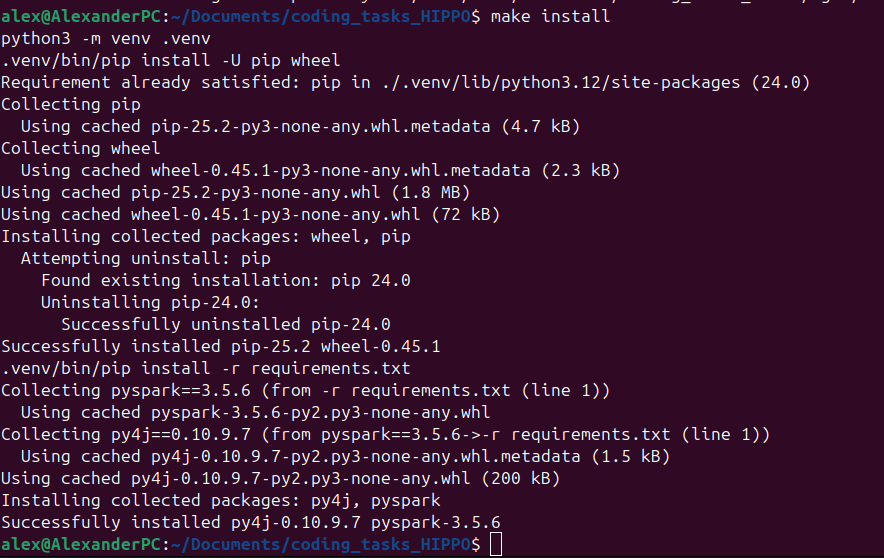

# Hippo Coding tasks

## Overview
This repository contains an implementation of the tasks for the Hippo coding challenge.

## Environment Setup
1. **Get the Source Code**
   - Download the project by cloning it with `git clone` or by grabbing the archive from the repository.

2. **Install Requirements**
   - Make sure you have Python 3.12. We'll use venv and will install PySpark if needed.
   - Install required libraries with:
     ```bash
     make install
     ```

     

## Data Preparation
1. **Organize Input Files**
   - Arrange your data directory in the following structure:
     ```
     data/
     ├── claims/
     ├── pharmacies/
     ├── reverts/
     ```
     


## How to Run
- Execute the tasks step by step with these commands:
  ```bash
  make run_task_1_2
  make run_task_3
  make run_task_4
  ```


## Tasks
1. **Task 1**
   - Read data stored in JSON files
   ```bash
   make run_task_1_2.py
   ```

   

2. **Task 2**
   - Calculate metrics for some dimensions 
      - Result will be stored in `results` directory

   

   - Sample of `tasks_1_2_result.json`

   

3. **Task 3**
   - Make a recommendation for the top 2 Chain to be displayed for each Drug.
   ```bash
   make run_task_3
   ```

   - Sample of `task_3_result.json`

   

4. **Task 4**
   - Understand Most common quantity prescribed for a given Drug
   ```bash
   make run_task_4
   ```

   - Sample of `task_4_result.json`.

   


## How to finish and clean venv
   - Stop working venv with
   ```bash
   make clean
   ```

   


## *Optional*
   - You can update `requirements.txt` with you current venv if needed
   ```bash
   make freeze
   ```


